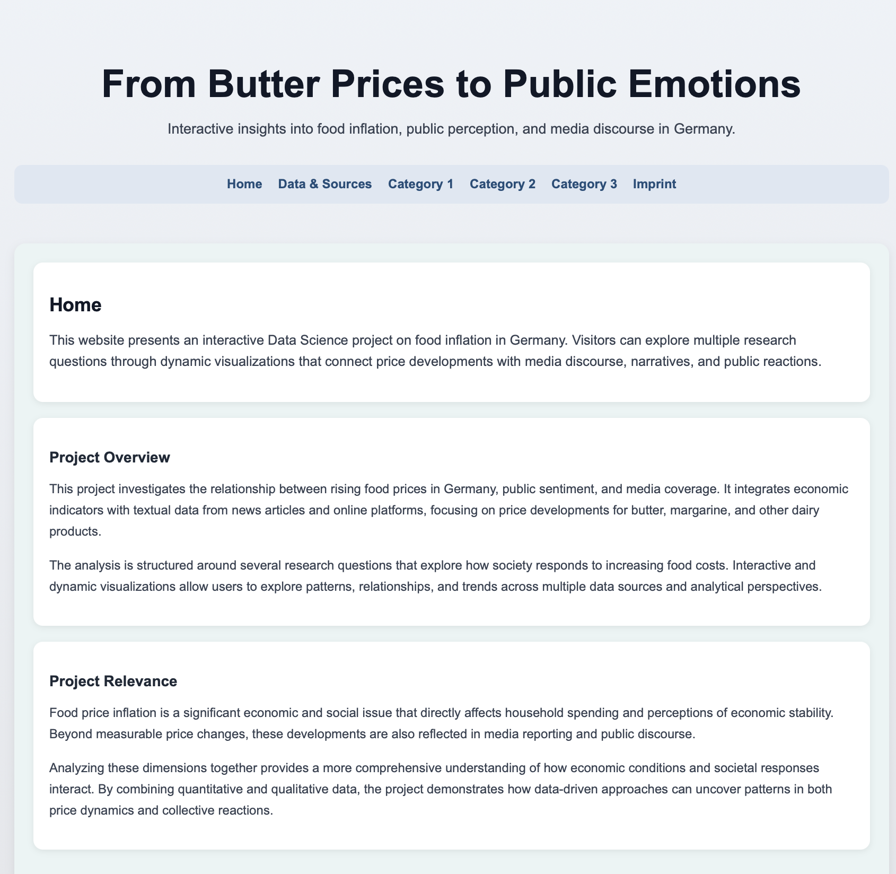

# From Butter Prices to Public Emotions  
Interactive insights into food inflation, public perception, and media discourse in Germany

Christian-Albrechts-Universität zu Kiel  
Data Science Project (inf-DSProj-01a)


## Team

- Ceyda Dut – stu247737  
- Ahmad Aldali – stu247158  
- Ali Al Mahmoud – stu246024  
- Rayyan – stu244778  


## 1. Overview 

This project analyses how food price inflation in Germany, with a focus on butter, is reflected in media coverage, online narratives, and indicators of public attention.  
It integrates official economic statistics, large-scale media data, and online behaviour measures into an interactive dashboard that allows users to explore relationships between prices, sentiment, narratives, and public concern.

The repository demonstrates the full workflow of a modern Data Science project: from data collection via APIs, through cleaning and feature engineering, to interactive visualisation in a web application.


## 2. Project Preview 

**Live Dashboard:**  
[Open the interactive dashboard](https://food-inflation.onrender.com)

**Dashboard Preview:**  



The dashboard presents interactive time series, scatter plots, heatmaps, and stacked bar charts that visualise:

- Butter, dairy, and margarine price dynamics over time  
- Gaps between consumer and producer prices  
- Media sentiment and narrative distributions  
- Links between price changes, media coverage, and online search interest  

Users can navigate between analytical categories and research questions, filter views, and directly compare economic indicators with media and public signals.


## 3. Motivation and Objectives 

Food price inflation directly affects households and is a central topic in public debate, especially when essential items such as butter become significantly more expensive.  
At the same time, perceptions of inflation are shaped not only by personal experience but also by media reporting, social media narratives, and collective discussions.

Butter is used as a focused case study because it is a widely consumed staple, highly salient in German public discourse, and well-covered in official price statistics.  
By using butter as an anchor product, the project investigates:

- How prices evolve along the value chain (producer vs. retail)  
- How relative prices change compared with close substitutes (e.g. margarine)  
- How price movements interact with media sentiment, narratives, and signs of economic stress in online discourse  

The main objectives are to:

- Quantify price dynamics and potential margin expansion in the butter and dairy market  
- Link inflation measures to media coverage, sentiment, and narratives across platforms  
- Analyse patterns of public concern and attention related to rising food prices  
- Provide an interactive, transparent dashboard that supports exploratory analysis and teaching


## 4. Research Questions

### Category 1 – Price Dynamics, Inflation, and Retail Behaviour

This category investigates how butter prices evolve along the value chain and relative to comparable products during periods of food inflation in Germany. It focuses on transmission mechanisms, deviations from expected patterns, and the role of policy interventions and cost structures.

- **RQ1:** What forms of asymmetric price transmission can be observed between producer prices and retail butter prices over time?  
- **RQ2:** How do butter and margarine consumer prices co-move during periods of elevated food inflation, and how does their relative price ratio evolve?  
- **RQ3:** In which periods do butter retail prices exhibit statistically unusual deviations from model-based expectations, and how large are these deviations?  
- **RQ4:** How did the temporary VAT reduction in 2020 affect retail butter prices, and to what extent were these effects offset or reversed by subsequent inflation?  
- **RQ5:** During which periods do retail butter prices increase faster than producer prices, indicating potential margin expansion between CPI and PPI?

### Category 2 – Regional Inequality and Public Sentiment

This category examines how media reporting reflects and potentially amplifies public perceptions of food inflation. It links news sentiment measures to observed price developments.

- **RQ6:** How is media sentiment regarding food inflation in German news coverage distributed over time, and how does this sentiment relate to observed food price trends?

### Category 3 – Narratives, Emotion, and Economic Stress

This category analyses how inflation-related narratives and emotions are articulated across different media platforms and how they connect to broader economic concerns. It combines narrative classification with indicators of public attention and stress.

- **RQ7:** How does the volume and intensity of media coverage of food inflation differ between periods of low and high inflation?  
- **RQ8:** Which food inflation narratives are most prevalent across news articles, YouTube videos, and YouTube comments, and how do their relative frequencies differ between platforms?  
- **RQ9:** How strongly are rising food prices associated with indicators of economic concern in German online discourse, such as references to financial stress or reduced purchasing power?


## 5. Key Insights & Findings 

The analysis yields several substantive insights about the interaction between price dynamics, media discourse, and public concern:

- **Butter vs. margarine dynamics:** Butter prices increased faster and more strongly than margarine during key phases of food inflation, leading to a notable rise in the butter–margarine price ratio rather than a parallel movement.  
- **CPI vs. PPI gaps and margins:** Periods with pronounced gaps between butter consumer price inflation (CPI) and dairy producer price inflation (PPI) suggest phases of margin expansion at the retail level.  
- **Delayed price reactions:** Changes in producer prices were not always transmitted immediately to retail butter prices, indicating asymmetric and delayed pass-through mechanisms.  
- **Unusual price deviations:** Model-based residual analysis identified specific months in which butter prices deviated significantly from expected trends, signalling potential shocks or non-standard pricing behaviour.  
- **Media–inflation mismatch:** Peaks in media coverage and strong sentiment about food inflation did not always coincide with the highest measured inflation rates, pointing to a partial decoupling of media attention and price statistics.  
- **Narrative differences across platforms:** News media tended to emphasise analytical narratives (e.g. monetary policy, energy and tax costs), while YouTube videos and especially comments more frequently framed inflation in terms of corporate greed and political failure.  
- **Public concern patterns:** Increases in food prices were associated with higher levels of online discussion reflecting economic concern, such as references to reduced purchasing power and financial stress.  
- **Attention and prices:** Rising butter prices correlated with elevated Google search interest in butter and related terms, indicating that price changes translate into measurable shifts in public attention.


## 6. Data Sources 

### Economic Data

- **Destatis (German Federal Statistical Office)**  
  - Consumer price indices (CPI) for butter, dairy, margarine, and related categories  
  - Additional inflation and reference series  

- **Eurostat**  
  - Harmonised and comparative European indicators relevant to food inflation  

- **FAOSTAT (UN Food and Agriculture Organization)**  
  - Agricultural production and price information for contextual analysis  

- **FRED (Federal Reserve Economic Data)**  
  - International macroeconomic and financial data where required  

- **Yahoo Finance API**  
  - Market price series for selected commodities and related financial indicators  

### Media Data

- **GDELT API**  
  - Global news coverage on food inflation and related topics, including metadata and textual content  

- **News API**  
  - Additional news articles on food prices and inflation in Germany  

- **YouTube Data API**  
  - Video metadata and comments related to food inflation, butter prices, and cost-of-living topics  

### Public Data

- **Google Trends (Pytrends)**  
  - Search interest for butter, food inflation, and related terms as a proxy for public attention  

All data used in the dashboard are stored in processed form as CSV files under `website/data/`.

### RQ1 Dataset: CPI–PPI Dynamics 

It contains monthly data on butter consumer prices (CPI) and dairy producer prices (PPI) in Germany.

**Variables:**
- `month`: Time index (monthly)
- `butter_cpi`: Consumer price index for butter
- `dairy_ppi`: Producer price index for dairy products
- `dairy_cpi`: Consumer price index for dairy products
- `ppi_change`: Monthly change in producer prices
- `butter_change`: Monthly change in butter prices
- `ppi_direction`: Direction of producer price change (increase/decrease)

The dataset is used to analyse asymmetric price transmission between producer and retail levels.

### RQ2 Dataset: Butter vs. Margarine Price Dynamics

This dataset contains monthly consumer price indices (CPI) for butter and margarine in Germany, allowing a comparison of their relative price development over time.

**Variables:**
- `month`: Time index (monthly)
- `butter_cpi`: Consumer price index for butter
- `margarine_cpi`: Consumer price index for margarine
- `price_gap`: Difference between butter and margarine prices (butter_cpi - margarine_cpi)
- `inflation_period`: Boolean indicator marking periods of elevated food inflation

The dataset is used to analyse how the relative price dynamics between butter and margarine evolve, especially during periods of high inflation.

### RQ3 Dataset: Deviations from Expected Butter Prices

This dataset contains observed and model-predicted butter consumer price indices (CPI) in Germany, along with residual-based deviation measures.

**Variables:**
- `datum`: Time index (monthly)
- `butter_cpi`: Observed consumer price index for butter
- `predicted_butter_cpi`: Model-based expected butter price
- `residual`: Difference between observed and predicted values (actual - predicted)
- `residual_zscore`: Standardised residual indicating the magnitude of deviation
- `significant_deviation`: Boolean indicator for statistically significant deviations
- `deviation_direction`: Direction of deviation (e.g. lower_than_expected, not_significant)

The dataset is used to identify periods in which butter prices significantly deviate from expected trends, indicating unusual market behaviour.

### RQ4 Dataset: VAT Reduction and Inflation Effects

This dataset summarises key price developments across different policy and inflation periods in Germany, focusing on the impact of the temporary VAT reduction in 2020 and subsequent inflation.

**Variables:**
- `period`: Defined time period (before VAT reduction, during VAT reduction, inflation phase)
- `gap_start`: Initial difference between butter CPI and dairy PPI at the beginning of the period
- `gap_end`: Final difference between butter CPI and dairy PPI at the end of the period
- `butter_start`: Butter CPI at the beginning of the period
- `butter_end`: Butter CPI at the end of the period
- `ppi_start`: Dairy PPI at the beginning of the period
- `ppi_end`: Dairy PPI at the end of the period

The dataset is used to analyse how retail butter prices and producer prices evolved across policy interventions and inflation phases, and whether VAT reductions had a lasting effect.

### RQ5 Dataset: CPI–PPI Gap and Margin Expansion

This dataset contains year-over-year (YoY) percentage changes in butter consumer prices (CPI) and dairy producer prices (PPI), allowing the analysis of potential margin expansion in the retail sector.

**Variables:**
- `date`: Time index (monthly)
- `butter_yoy_pct`: Year-over-year percentage change in butter CPI
- `dairy_ppi_yoy_pct`: Year-over-year percentage change in dairy PPI
- `margin_gap`: Difference between consumer and producer price inflation (butter_yoy_pct - dairy_ppi_yoy_pct)
- `margin_expansion_flag`: Boolean indicator marking periods where consumer prices increase significantly faster than producer prices

The dataset is used to identify periods of potential margin expansion, where retail prices rise more strongly than production costs.

### RQ6 Dataset: Media Sentiment and Price Trends

This dataset combines media sentiment observations with official price data to analyse how public sentiment relates to food price developments.

**Structure:**
The dataset contains two types of entries:
- `sentiment`: individual sentiment scores derived from media sources
- `prices`: monthly consumer price indices for butter and dairy products

**Variables:**
- `type`: Indicates whether the row represents sentiment data or price data (`sentiment` or `prices`)
- `date`: Time index (available for price data)
- `sentiment`: Sentiment score of media content (range approximately from -1 to 1)
- `dairy_cpi`: Consumer price index for dairy products
- `butter_cpi`: Consumer price index for butter

The dataset is used to explore how negative or positive media sentiment evolves over time and how it relates to actual price developments.

### RQ7 Dataset: Media Coverage and Inflation Regimes

This dataset captures the relationship between inflation levels and the volume of media coverage on food inflation.

**Variables:**
- `month`: Time index (monthly)
- `inflation_yoy`: Year-over-year inflation rate
- `article_count`: Number of media articles related to food inflation
- `inflation_regime`: Categorisation of inflation periods (e.g. high inflation vs. lower inflation)

The dataset is used to analyse how the intensity of media coverage changes across different inflation regimes and whether higher inflation leads to increased media attention.

### RQ8 Dataset: Narrative Distribution Across Platforms

This dataset captures the distribution of different food inflation narratives across multiple media platforms.

**Variables:**
- `platform`: Source of the content (news, YouTube videos, YouTube comments)
- `narrative`: Classified narrative category (e.g. corporate greed, political failure, monetary causes, energy and tax costs, other)
- `count`: Number of occurrences of each narrative within the platform

The dataset is used to compare how different platforms frame food inflation and to identify differences in narrative emphasis between professional media and user-generated content.

### RQ9 Dataset: Prices, Public Attention, and Economic Concern

This dataset combines multiple data sources to analyse how rising food prices relate to public attention and indicators of economic concern.

**Structure:**
The dataset contains three types of entries:
- `price_indices`: Long-term time series of butter, dairy, and margarine price indices
- `price_vs_search`: Combined observations of butter prices and Google search interest
- `economic_concern`: Distribution of economic concern levels derived from online discourse

**Variables:**
- `type`: Indicates the data type (`price_indices`, `price_vs_search`, or `economic_concern`)
- `date`: Time index for price data
- `year_month`: Time index for combined price–search data
- `butter_price`: Consumer price index for butter
- `dairy_price`: Consumer price index for dairy products
- `margarine_price`: Consumer price index for margarine
- `butter_search_interest`: Google Trends index for butter-related searches
- `fear_score`: Indicator of economic concern in online discourse
- `count`: Frequency of observations for each concern level

The dataset is used to analyse how increases in food prices relate to public attention (search behaviour) and expressions of economic concern in online discussions.


## 7. Data Pipeline 

The project follows a structured, reproducible data pipeline that separates raw collection from analysis and visualisation.

1. **Data collection via APIs**  
   - Retrieval of economic, media, and public attention data via Python scripts and notebooks using the respective APIs.  

2. **Storage in JSON and CSV**  
   - API responses are first saved as raw JSON for traceability.  
   - Relevant fields are extracted and exported to intermediate CSV files for tabular processing.  

3. **Data cleaning and filtering**  
   - Filtering by country (Germany), time window (primarily 2020–2024), product categories (butter, dairy, margarine), and relevant keywords.  
   - Handling of missing values, outliers, and inconsistent units or date formats.  

4. **Aggregation to monthly level**  
   - Conversion of daily or irregular data (e.g. news, comments, search interest) to monthly aggregates.  
   - Alignment of all time series to a common monthly frequency.  

5. **Merging of datasets via time keys**  
   - Joining economic, media, and public attention data on month/year indices.  
   - Construction of integrated tables that enable joint analysis of prices, sentiment, narratives, and attention.  

6. **Derivation of analytical variables**  
   - **Price ratios** (e.g. butter CPI / margarine CPI).  
   - **CPI–PPI gaps** as proxies for potential margin expansion.  
   - **Sentiment scores** from textual data (e.g. news articles, comments).  
   - **Narrative labels** based on classification (e.g. corporate greed, political failure, monetary causes, energy and tax costs, other).  

7. **Analysis in Jupyter notebooks**  
   - Exploratory data analysis, visual inspection, and model-based analyses (e.g. residuals and z-scores).  
   - Preparation of clean, analysis-ready tables tailored to each research question.  

8. **Export of final datasets (rq1–rq9)**  
   - For each research question, a dedicated CSV file is saved to `website/data/` with names:  
     - `rq1_data.csv`, `rq2_data.csv`, …, `rq9_data.csv`  
   - Each file contains only the variables required for the corresponding dashboard view to keep loading times low.


## 8. Technologies & Methods 

The project combines a modern Python-based technology stack with standard empirical methods used in applied Data Science.

**Languages and Libraries**

- Python  
- Pandas, NumPy (data manipulation and analysis)  
- Plotly (interactive visualisations)  
- Dash (web application framework)  

**APIs and Data Access**

- HTTP-based API requests for economic, media, and public data  
- Automated query construction and basic error handling  

**Analytical Methods**

- Time series analysis of prices, inflation rates, and search interest  
- Comparative analysis of CPI vs. PPI and price ratios  
- Residual and outlier analysis to detect unusual price deviations  
- Sentiment analysis of news and online content  
- Narrative classification across platforms (news, YouTube videos, and comments)  
- Descriptive and exploratory statistics to link prices, media activity, and public concern  

## 9. Repository & App Structure 

### Note on `inflation_project/raw_data/`

The folder `inflation_project/raw_data/` contains the research notebooks, intermediate raw API files (mainly JSON), exported figures, and selected processed CSV files used during the analytical workflow.

The folder name was kept for consistency with the notebook paths used throughout the project.  
Although it contains more than only raw data, retaining this structure ensured reproducibility and avoided breaking relative file references shortly before submission.


The core of the interactive dashboard resides in the `website/` directory. A typical structure is:

```bash
website/
├── app.py          # Main Dash application, layout, and callback registration
├── pages/          # Page definitions for categories and research questions
├── figures/        # Plot creation logic (time series, scatter, heatmaps, etc.)
├── components/     # Reusable UI components (navigation, headers, controls)
├── data/           # Processed CSV datasets (rq1_data.csv ... rq9_data.csv)
└── requirements.txt
```md

### How the Website Was Built and Deployed

The web application was built with **Dash** and **Plotly** in Python.  
Each research question is connected to a dedicated preprocessed CSV file stored in `website/data/`.  
The corresponding figure functions load these datasets and generate interactive charts that are embedded into the dashboard pages.

The application is deployed on **Render**.  
At runtime, the dashboard does not call external APIs. Instead, it uses the preprocessed CSV files included in the repository, which improves stability, reproducibility, and loading speed.

## 10. Dashboard Features 

The dashboard is designed to support interactive, exploratory analysis rather than static reporting.  
It enables users to interrogate relationships between prices, media coverage, narratives, and public attention in a flexible way.

**Key features include:**

- **Interactive visualisations**  
  Zoomable and pannable charts for time series, scatter plots, heatmaps, and stacked bar charts.

- **Dropdown-based selection**  
  Controls to select products, time periods, inflation phases (e.g. low vs. high), and narrative categories.

- **Hover tooltips**  
  Detailed values for inflation rates, sentiment scores, narrative shares, and search interest on demand.

- **Comparative views**  
  - Overlays of CPI and PPI to inspect inflation gaps.  
  - Parallel displays of price series and media coverage.  
  - Cross-platform comparisons of narratives (news vs. YouTube videos vs. comments).

These features make it straightforward to explore complex relationships between economic indicators and public discourse.


## 11. Using the Website 

### Navigation

The main navigation separates the dashboard into the three core categories:

1. **Price Dynamics, Inflation, and Retail Behaviour**  
2. **Regional Inequality and Public Sentiment**  
3. **Narratives, Emotion, and Economic Stress**

In addition, the navigation includes the **Home**, **Data & Sources**, and **Imprint** pages.

Within each category, subpages or sections correspond to the individual research questions (RQ1–RQ9), allowing users to directly access the relevant analytical views.

### Interaction with Visualisations

- Use dropdowns and toggles to switch between products, time periods, inflation regimes (low vs. high), or narrative groups.  
- Hover over points, bars, and cells to see precise values and contextual information.  
- Use the zoom tools in time series plots to focus on specific intervals (e.g. around the 2020 VAT reduction).  
- Click on legend entries to show or hide individual series (e.g. butter vs. margarine, CPI vs. PPI).

### Comparing Perspectives

Navigate across categories to compare:

- Price dynamics and potential margin expansion (**Category 1**)  
- Media sentiment and its evolution over time (**Category 2**)  
- Narrative shifts and indicators of economic stress in online discourse (**Category 3**)

This structure allows users to move seamlessly from quantitative price patterns to qualitative narrative patterns.

## 12. Running Locally 

To run the dashboard on a local machine:

```bash
# 1. Clone the repository
git clone <REPOSITORY-URL>
cd website

# 2. (Optional) Create and activate a virtual environment
# python -m venv .venv
# source .venv/bin/activate      # Windows: .venv\Scripts\activate

# 3. Install dependencies
pip install -r requirements.txt

# 4. Start the Dash app
python app.py

Then open a browser and go to http://..../ (the address shown in the terminal)

The local dashboard uses the preprocessed CSV files in website/data/ and does not rely on live API calls


## 13. Challenges & Limitations 

The project faced several practical and methodological challenges:

- **API limitations and reliability**  
  Temporary outages, changing endpoints, and rate limits required caching, retries, and, in some cases, adjustments to the data collection plan.

- **Data integration complexity**  
  Combining official statistics, media data, and online behaviour measures with different granularities and formats demanded careful alignment and validation.

- **Time constraints**  
  Delays early in the coding phase limited the scope for more advanced models and robustness checks, particularly for narrative classification and causal inference.

- **Deployment issues**  
  Deploying the Dash application on Render involved resolving dependency conflicts, memory constraints, and cold-start delays.

These limitations should be considered when interpreting the results and when extending or reusing the project.


## 14. Use of LLMs 

Large Language Models (LLMs) were used selectively as support tools during the project:

- To clarify error messages, suggest alternative implementations, and improve the structure and readability of code and documentation.  
- To refine formulations of research questions and explanatory text while preserving the underlying analytical content.

All outputs from LLMs were critically reviewed, adapted, and integrated manually by the project team.  
No code or text was adopted without scrutiny, and all core analytical decisions, interpretations, and final conclusions were made by the students.

## Code Origin and External Support

Parts of the website structure (especially layout, navigation, and basic Dash setup) are based on course-provided examples and standard Dash templates.

These components were adapted, extended, and integrated into our project.

All analytical logic, data processing, and visualizations were developed independently by the project team.


## 15. Conclusion

This project shows how combining detailed price indices with media sentiment, narrative analysis, and indicators of public attention can deepen the understanding of food inflation as both an economic and a social phenomenon.  
By focusing on butter as a salient everyday product, the analysis reveals concrete mechanisms of price transmission, margin expansion, narrative framing, and public concern.  
The interactive dashboard translates these results into an accessible tool for exploration and teaching, demonstrating a complete Data Science workflow from raw data collection to interpretable, reproducible visual analytics.
